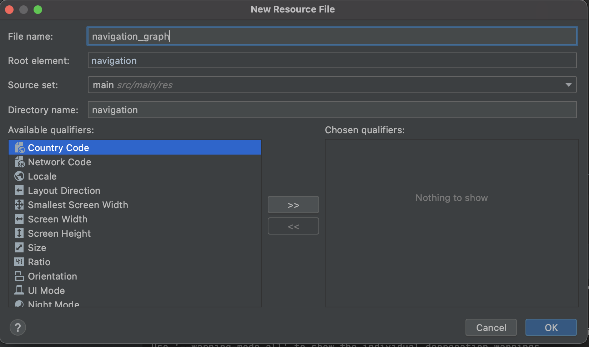
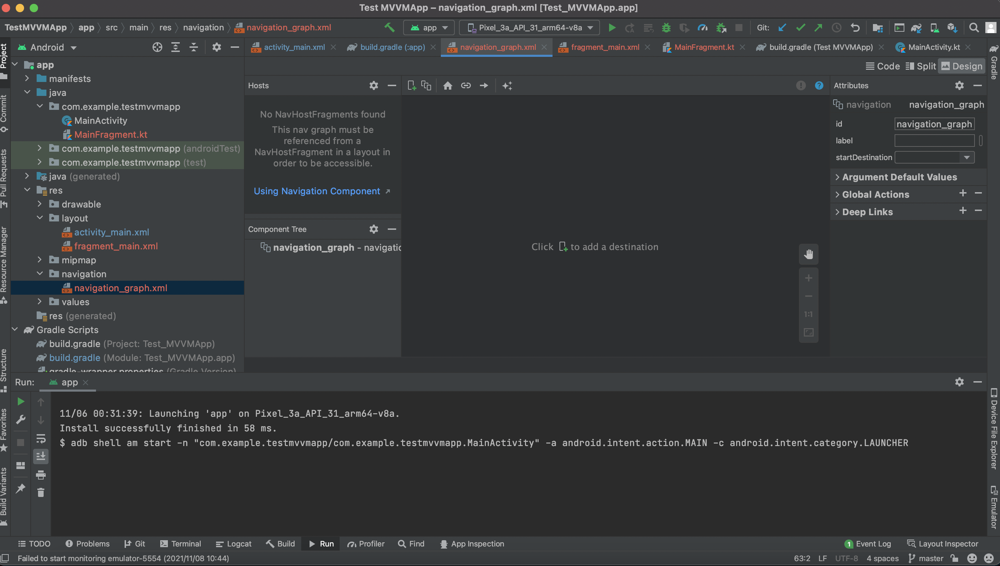

# AndroidSample

## 環境設定
- MacOS Big Sur Ver 11.3.1
- Android Studio Arctic Fox (2020.3.1) Patch 4
- Android Gradle Plugin Version 7.0.3
- Gradle Version 7.0.2
- kotlin-gradle-plugin Version 1.5.31


## gitignoreの設定
[gitignore.io](https://www.toptal.com/developers/gitignore)
上記で`Android`、`AndroidStudio`で検索かけて出てきたものを追加。

## 導入ライブラリ
ライブラリ記載場所：`build.gradle(app内)`
下記内に記載する。
```
dependencies {

}
```
- [Timber](https://github.com/JakeWharton/timber)
  - Android向けのロガーライブラリ
  - 参考：[ロガーライブラリ「Timber」のセットアップ&操作方法(Kotlin)](https://qiita.com/uhooi/items/4f9e41ea9aceaf5abf5b)

## gradleのライブラリバージョン管理
### `ext`で管理
`ext`、Gradleによると`Extra Properties`のこと
```
ext {
    nav_version = "2.3.5"
}

ext.nav_version = "2.3.5"

dependencies {
    implementation "androidx.navigation:navigation-fragment-ktx:$nav_version"
}
```

## [Navigation Component](https://developer.android.com/guide/navigation/navigation-testing?hl=ja)
### 導入方法
`build.gradle(Module)`にNavigation Componentのライブラリを導入する
```
dependencies {
    // 現在の最新バージョン
    def nav_version = "2.4.1"

    // Java language implementation
    implementation "androidx.navigation:navigation-fragment:$nav_version"
    implementation "androidx.navigation:navigation-ui:$nav_version"

    // Kotlin
    implementation "androidx.navigation:navigation-fragment-ktx:$nav_version"
    implementation "androidx.navigation:navigation-ui-ktx:$nav_version"

    // Feature module Support
    implementation "androidx.navigation:navigation-dynamic-features-fragment:$nav_version"

    // Testing Navigation
    androidTestImplementation "androidx.navigation:navigation-testing:$nav_version"

    // Jetpack Compose Integration
    implementation "androidx.navigation:navigation-compose:"
}
```

### Navigation Graphの作成
#### Resource Fileの作成
1. resフォルダで新規作成でnavigationフォルダを新規作成する
`resディレクトリを右クリック` > `New` >`Android Resource File`を選択し、`New Resource File`を開いて必要情報を入力する。 

  

2. リソースファイルを作成すると、Navigation Editorが開く。  

  

3. `New Distination`よりFragmentを追加する。すでにある作成しているFragmentの場合は選択できる。
4. `activity_main.xml`に下記を追加することで、Navigationの設定をする。  

```
<fragment
    android:id="@+id/nav_host_fragment"
    android:name="androidx.navigation.fragment.NavHostFragment"
    android:layout_width="match_parent"
    android:layout_height="match_parent"
    app:navGraph="@navigation/navigation_graph" // これが1.で作成したリソースファイルを指定している
    app:layout_constraintBottom_toBottomOf="parent"
    app:layout_constraintEnd_toEndOf="parent"
    app:layout_constraintStart_toStartOf="parent"
    app:layout_constraintTop_toTopOf="parent" />
```

### `Navigation Component`参考URL
- [Navigation Componentの基本的な使い方](https://qiita.com/fu_neko/items/9dcb81c5878e5ce06230)
- 
